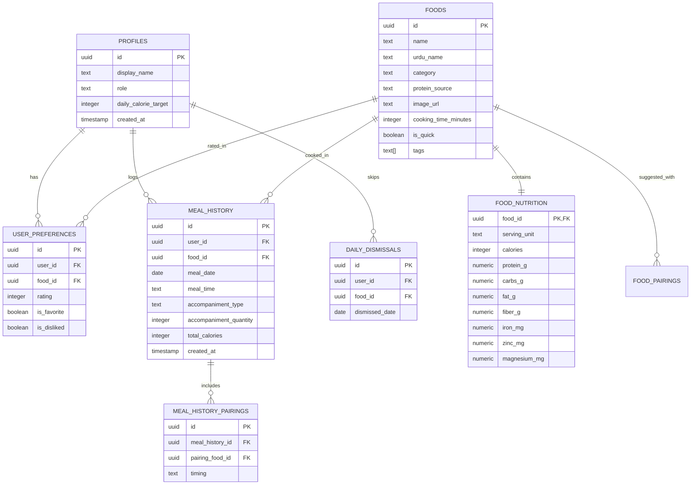

# Database & Nutrition Data Model Specification — Aaj Kya Banaun? (آج کیا بناؤں؟)

> **Purpose:** This document specifies the complete Supabase PostgreSQL relational schema, Row Level Security (RLS) policies, types, indexes, and initial seed dataset of 45 authentic Pakistani dishes.

---

## 1. Entity Relationship Diagram (ERD)



---

## 2. Supabase SQL DDL Schema

```sql
-- Enable UUID extension
CREATE EXTENSION IF NOT EXISTS "uuid-ossp";

-- 1. Profiles Table
CREATE TABLE public.profiles (
    id UUID PRIMARY KEY REFERENCES auth.users(id) ON DELETE CASCADE,
    display_name TEXT NOT NULL DEFAULT 'Ammi',
    household_name TEXT NOT NULL DEFAULT 'Hamara Ghar',
    daily_calorie_target INTEGER DEFAULT 2000,
    created_at TIMESTAMPTZ DEFAULT timezone('utc'::text, now()) NOT NULL
);

-- 2. Foods Table (Master Catalog)
CREATE TABLE public.foods (
    id UUID PRIMARY KEY DEFAULT uuid_generate_v4(),
    name TEXT NOT NULL UNIQUE,
    urdu_name TEXT NOT NULL,
    category TEXT NOT NULL CHECK (category IN ('rice', 'meat', 'daal', 'sabzi', 'side', 'dry_fruit', 'fruit')),
    protein_source TEXT CHECK (protein_source IN ('chicken', 'mutton', 'beef', 'egg', 'plant', 'none')),
    image_url TEXT,
    cooking_time_minutes INTEGER DEFAULT 45,
    is_quick BOOLEAN DEFAULT false,
    tags TEXT[] DEFAULT '{}',
    created_at TIMESTAMPTZ DEFAULT timezone('utc'::text, now()) NOT NULL
);

-- 3. Food Nutrition Table (1-to-1 with Foods)
CREATE TABLE public.food_nutrition (
    food_id UUID PRIMARY KEY REFERENCES public.foods(id) ON DELETE CASCADE,
    serving_unit TEXT NOT NULL DEFAULT '1 standard serving',
    calories INTEGER NOT NULL,
    protein_g NUMERIC(5, 1) NOT NULL DEFAULT 0,
    carbs_g NUMERIC(5, 1) NOT NULL DEFAULT 0,
    fat_g NUMERIC(5, 1) NOT NULL DEFAULT 0,
    fiber_g NUMERIC(5, 1) NOT NULL DEFAULT 0,
    iron_mg NUMERIC(5, 1) DEFAULT 0,
    zinc_mg NUMERIC(5, 1) DEFAULT 0,
    magnesium_mg NUMERIC(5, 1) DEFAULT 0
);

-- 4. User Food Preferences Table
CREATE TABLE public.user_preferences (
    id UUID PRIMARY KEY DEFAULT uuid_generate_v4(),
    user_id UUID NOT NULL REFERENCES public.profiles(id) ON DELETE CASCADE,
    food_id UUID NOT NULL REFERENCES public.foods(id) ON DELETE CASCADE,
    rating INTEGER CHECK (rating BETWEEN 1 AND 5) DEFAULT 3,
    is_favorite BOOLEAN DEFAULT false,
    is_disliked BOOLEAN DEFAULT false,
    updated_at TIMESTAMPTZ DEFAULT timezone('utc'::text, now()) NOT NULL,
    UNIQUE (user_id, food_id)
);

-- 5. Meal History Table (Logged Meals)
CREATE TABLE public.meal_history (
    id UUID PRIMARY KEY DEFAULT uuid_generate_v4(),
    user_id UUID NOT NULL REFERENCES public.profiles(id) ON DELETE CASCADE,
    food_id UUID NOT NULL REFERENCES public.foods(id) ON DELETE RESTRICT,
    meal_date DATE NOT NULL DEFAULT CURRENT_DATE,
    meal_time TEXT NOT NULL CHECK (meal_time IN ('lunch', 'dinner', 'both')),
    accompaniment_type TEXT DEFAULT 'none' CHECK (accompaniment_type IN ('roti', 'rice', 'naan', 'none')),
    accompaniment_quantity INTEGER DEFAULT 0,
    total_calories INTEGER NOT NULL,
    notes TEXT,
    created_at TIMESTAMPTZ DEFAULT timezone('utc'::text, now()) NOT NULL
);

-- 6. Meal History Pairings Table (Sides & Evening Snacks)
CREATE TABLE public.meal_history_pairings (
    id UUID PRIMARY KEY DEFAULT uuid_generate_v4(),
    meal_history_id UUID NOT NULL REFERENCES public.meal_history(id) ON DELETE CASCADE,
    pairing_food_id UUID NOT NULL REFERENCES public.foods(id) ON DELETE RESTRICT,
    timing TEXT NOT NULL CHECK (timing IN ('with_meal', 'later_today')),
    created_at TIMESTAMPTZ DEFAULT timezone('utc'::text, now()) NOT NULL
);

-- 7. Daily Dismissals (Temporary "Aaj Nahi" skips)
CREATE TABLE public.daily_dismissals (
    id UUID PRIMARY KEY DEFAULT uuid_generate_v4(),
    user_id UUID NOT NULL REFERENCES public.profiles(id) ON DELETE CASCADE,
    food_id UUID NOT NULL REFERENCES public.foods(id) ON DELETE CASCADE,
    dismissed_date DATE NOT NULL DEFAULT CURRENT_DATE,
    created_at TIMESTAMPTZ DEFAULT timezone('utc'::text, now()) NOT NULL,
    UNIQUE (user_id, food_id, dismissed_date)
);

-- Indexes for lightning fast recommendation queries
CREATE INDEX idx_meal_history_user_date ON public.meal_history(user_id, meal_date DESC);
CREATE INDEX idx_user_preferences_user ON public.user_preferences(user_id);
CREATE INDEX idx_foods_category ON public.foods(category);
CREATE INDEX idx_daily_dismissals_lookup ON public.daily_dismissals(user_id, dismissed_date);
```

---

## 3. Seed Dataset: 45 Authentic Pakistani Foods

A balanced catalog tailored for household meal planning:

### Group 1: Rice Dishes (Chawal)
1. **Chicken Biryani (چکن بریانی)** — 650 kcal, 34g P, 82g C, 22g F, 3.2mg Iron.
2. **Beef Biryani (بیف بریانی)** — 720 kcal, 38g P, 82g C, 28g F, 4.5mg Iron.
3. **Chicken Pulao (چکن پلاؤ)** — 580 kcal, 30g P, 75g C, 18g F, 2.8mg Iron.
4. **Mutton Pulao (مٹن پلاؤ)** — 640 kcal, 32g P, 75g C, 24g F, 3.8mg Iron.
5. **Matar Pulao (مٹر پلاؤ)** — 450 kcal, 10g P, 78g C, 12g F, 2.1mg Iron.
6. **Daal Chawal (دال چاول)** — 480 kcal, 16g P, 85g C, 8g F, 3.5mg Iron.

### Group 2: Meat, Karahi & Salan
7. **Chicken Karahi (چکن کڑاہی)** — 420 kcal, 36g P, 6g C, 28g F, 2.5mg Iron.
8. **Mutton Karahi (مٹن کڑاہی)** — 490 kcal, 34g P, 5g C, 37g F, 4.0mg Iron.
9. **Chicken Handi (چکن ہانڈی)** — 460 kcal, 33g P, 8g C, 32g F, 2.1mg Iron.
10. **Chicken Qorma (چکن قورمہ)** — 480 kcal, 32g P, 10g C, 34g F, 2.2mg Iron.
11. **Mutton Qorma (مٹن قورمہ)** — 540 kcal, 30g P, 8g C, 42g F, 3.9mg Iron.
12. **Mutton Kaleji / Liver (مٹن کلیجی)** — 340 kcal, 40g P, 4g C, 18g F, **12.5mg Iron (High Iron Booster!)**.
13. **Chicken Stew (چکن اسٹو)** — 380 kcal, 32g P, 12g C, 22g F, 2.4mg Iron.
14. **Nihari (نہاری)** — 580 kcal, 38g P, 16g C, 40g F, 5.2mg Iron.
15. **Aloo Gosht (آلو گوشت)** — 440 kcal, 28g P, 18g C, 29g F, 3.6mg Iron.
16. **Chicken Kofta (چکن کوفتہ)** — 410 kcal, 30g P, 12g C, 26g F, 2.6mg Iron.
17. **Keema Matar (قیمہ مٹر)** — 450 kcal, 32g P, 14g C, 29g F, 4.1mg Iron.

### Group 3: Eggs & Quick Dishes
18. **Aloo Anda (آلو انڈہ)** — 320 kcal, 14g P, 22g C, 20g F, 2.8mg Iron (Quick, Comfort food).
19. **Anda Bhurji / Khagina (خاگینہ)** — 280 kcal, 16g P, 6g C, 22g F, 2.5mg Iron.
20. **Egg Curry (انڈہ کری)** — 310 kcal, 15g P, 10g C, 23g F, 2.7mg Iron.
21. **Desi Omelette (دیسی آملیٹ)** — 240 kcal, 13g P, 4g C, 19g F, 2.1mg Iron.

### Group 4: Daal & Legumes
22. **Chana Dal (چنا دال)** — 290 kcal, 15g P, 40g C, 8g F, 3.8mg Iron, 8g Fiber.
23. **Moong Dal (مونگ دال)** — 240 kcal, 14g P, 36g C, 5g F, 3.0mg Iron, 7g Fiber.
24. **Masoor Dal (مسور دال)** — 230 kcal, 13g P, 35g C, 5g F, 3.2mg Iron, 6g Fiber.
25. **Mash Dal (ماش دال)** — 310 kcal, 16g P, 38g C, 11g F, 3.4mg Iron.
26. **Kala Chana Salan (کالا چنا)** — 310 kcal, 17g P, 44g C, 7g F, 4.2mg Iron, 10g Fiber.
27. **Lobia / Red Beans (لوبیا)** — 290 kcal, 16g P, 42g C, 6g F, 4.0mg Iron, 9g Fiber.

### Group 5: Sabzi / Vegetables
28. **Bhindi Masala (بھنڈی مصالحہ)** — 210 kcal, 5g P, 18g C, 14g F, 2.0mg Iron, 5g Fiber.
29. **Aloo Gajar Matar (آلو گاجر مٹر)** — 230 kcal, 6g P, 32g C, 9g F, 2.2mg Iron, 6g Fiber.
30. **Palak Aloo / Palak Paneer (پالک آلو)** — 220 kcal, 7g P, 16g C, 14g F, 4.8mg Iron.
31. **Aloo Gobi (آلو گوبھی)** — 210 kcal, 5g P, 24g C, 11g F, 1.8mg Iron.
32. **Baingan Bharta (بینگن کا بھرتہ)** — 180 kcal, 4g P, 16g C, 12g F, 1.5mg Iron.
33. **Tori Salan (توری سالن)** — 160 kcal, 3g P, 14g C, 10g F, 1.4mg Iron.
34. **Lauki / Kaddu (لوکی کا سالن)** — 150 kcal, 3g P, 12g C, 10g F, 1.3mg Iron.
35. **Shimla Mirch Keema (شملہ مرچ قیمہ)** — 390 kcal, 28g P, 12g C, 26g F, 3.5mg Iron.

### Group 6: Accompaniments, Sides & Healthy Pairings
36. **Whole Wheat Roti / Phulka (روٹی)** — 90 kcal, 3g P, 18g C, 0.5g F, 1.1mg Iron.
37. **Kachumar / Fresh Green Salad (تازہ سلاد)** — 30 kcal, 1g P, 6g C, 0.2g F, High Fiber.
38. **Zeera Cucumber Raita (زیرہ رائتہ)** — 55 kcal, 3g P, 4g C, 3g F, Calcium.
39. **Pudina Mint Chutney (پودینہ چٹنی)** — 20 kcal, 1g P, 3g C, 0.2g F, Digestion.
40. **Badam / Almonds (بادام - 6 pieces)** — 50 kcal, 2g P, 2g C, 4.5g F, 42mg Magnesium, Vitamin E.
41. **Akhrot / Walnuts (اخروٹ - 2 whole)** — 65 kcal, 1.5g P, 1.5g C, 6.5g F, Omega-3.
42. **Seb / Apple (سیب - 1 medium)** — 75 kcal, 0.5g P, 19g C, 0.3g F, Vitamin C.
43. **Kela / Banana (کیلا - 1 medium)** — 95 kcal, 1.2g P, 24g C, 0.3g F, Potassium.
44. **Garam Doodh / Warm Milk (ایک کپ)** — 130 kcal, 8g P, 11g C, 6g F, Calcium & Sleep aid.
45. **Khajoor / Dates (کھجور - 2 pieces)** — 55 kcal, 0.5g P, 14g C, 0.1g F, Fast Natural Energy.
